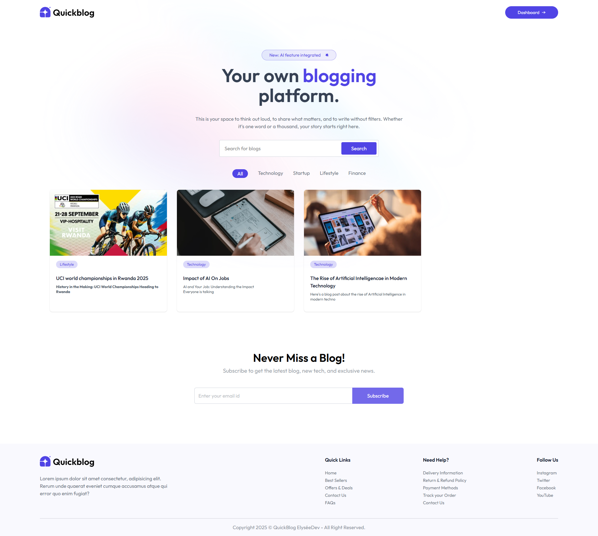
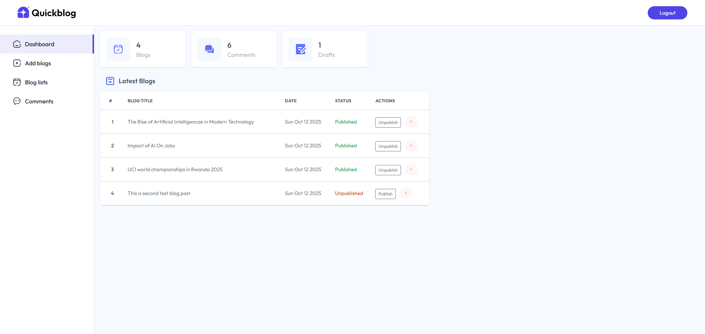

<div align="center">

# 𓂃🖊 QUICKBLOG ✍️ ᯓ➤

AI-Powered Blogging Platform with Intelligent Content Generation


_Powered by cutting-edge AI and modern technologies:_


## LIVE - DEMO 🌐

Visit the 👉 [_LINK 🔗_](https://elyseedev-quick-blog.vercel.app)

| User Interface | Admin Dashboard              |
| -------------- | ---------------------------- |
|   |  |

</div>

---

## Table of Contents

- [Overview](#overview)
- [Key Features](#key-features)
- [Tech Stack](#tech-stack)
- [Architecture](#architecture)
- [Getting Started](#getting-started)
  - [Prerequisites](#prerequisites)
  - [Installation](#installation)
  - [Environment Variables](#environment-variables)
- [AI Capabilities](#ai-capabilities)
- [Admin Dashboard](#admin-dashboard)
- [API Endpoints](#api-endpoints)
- [Deployment](#deployment)
- [Performance](#performance)
- [Contributing](#contributing)
- [License](#license)
- [Support](#support)

---

## Overview

QUICKBLOG is a revolutionary blogging platform that combines traditional content management with artificial intelligence to provide:

- 🤖 **AI Content Generation**: Automatically generate blog posts using Google Gemini
- 📝 **Rich Text Editor**: Advanced editing with Quill.js integration
- 👨‍💼 **Admin Dashboard**: Complete content management system
- 💬 **Comment System**: Engage readers with interactive discussions
- 🖼️ **Media Management**: Optimized image handling with ImageKit
- 📱 **Responsive Design**: Seamless experience across all devices

Built with the MERN stack and integrated with Google's Gemini AI for intelligent content creation.

---

## Key Features

### 🤖 AI-Powered Blogging

- **Content Generation**: Generate complete blog posts from prompts
- **Topic Suggestions**: AI-driven content ideas and outlines
- **SEO Optimization**: AI-assisted meta descriptions and titles
- **Content Enhancement**: Improve existing articles with AI suggestions

### 🎨 Advanced Editor

- **Quill.js Integration**: Rich text editor with formatting options
- **Markdown Support**: Dual editing capabilities
- **Image Embedding**: Drag-and-drop image uploads
- **Auto-save**: Never lose your work with automatic saving

### 👨‍💼 Admin Dashboard

- **Blog Management**: Create, edit, and delete blog posts
- **Comment Moderation**: Approve, delete, and manage user comments
- **Analytics**: View blog performance and reader engagement
- **User Management**: Manage authors and contributors

### 👥 Community Features

- **Comment System**: Threaded comments with replies
- **User Profiles**: Reader engagement and profiles
- **Social Sharing**: Easy content distribution
- **Newsletter Integration**: Email subscription management

### 🖼️ Media Management

- **ImageKit Integration**: Optimized image storage and delivery
- **Automatic Optimization**: Image compression and resizing
- **CDN Delivery**: Fast global content delivery
- **Gallery Management**: Organized media library

---

## Tech Stack

### Frontend (Client)

- **React 19** - Latest React with concurrent features
- **Vite** - Next-generation build tool
- **Tailwind CSS** - Utility-first CSS framework
- **Axios** - HTTP client for API calls
- **React Router DOM** - Client-side routing
- **Quill.js** - Rich text editor
- **React Hot Toast** - User notifications
- **Marked** - Markdown parsing
- **Moment.js** - Date formatting
- **Framer Motion** - Smooth animations

### Backend (Server)

- **Node.js** - JavaScript runtime environment
- **Express 6** - Web application framework
- **MongoDB** - NoSQL database with Mongoose ODM
- **Google Gemini AI** - Advanced AI content generation
- **ImageKit** - Image optimization and CDN
- **JWT** - Authentication tokens
- **Multer** - File upload handling
- **CORS** - Cross-origin resource sharing
- **Bcrypt** - Password hashing

### DevOps & Deployment

- **Vercel** - Frontend deployment platform
- **Render/Railway** - Backend deployment
- **MongoDB Atlas** - Cloud database service
- **ImageKit CDN** - Media content delivery

---

## Architecture

```groovy
QuickBlog/
├── client/                 # React Frontend
│   ├── src/
│   │   ├── assets/        # Static assets
│   │   ├── components/    # Reusable components
│   │   │   ├── BlogCard.jsx      # Blog post preview
│   │   │   ├── CommentSection.jsx # Comments and replies
│   │   │   ├── RichTextEditor.jsx # Quill.js editor
│   │   │   ├── SearchBar.jsx     # Blog search functionality
│   │   │   ├── Sidebar.jsx       # Navigation and categories
│   │   │   └── ...               # Other components
│   │   ├── pages/         # Route pages
│   │   │   ├── Admin/           # Admin dashboard pages
│   │   │   │   ├── Dashboard.jsx
│   │   │   │   ├── BlogManagement.jsx
│   │   │   │   ├── Comments.jsx
│   │   │   │   └── Analytics.jsx
│   │   │   ├── Blog/            # Blog-related pages
│   │   │   │   ├── BlogPost.jsx
│   │   │   │   ├── CreateBlog.jsx
│   │   │   │   ├── EditBlog.jsx
│   │   │   │   └── BlogList.jsx
│   │   │   ├── Home.jsx         # Landing page
│   │   │   ├── Login.jsx        # Authentication
│   │   │   └── Profile.jsx      # User profile
│   │   ├── context/       # React context
│   │   │   └── AppContext.jsx   # Global state management
│   │   ├── hooks/         # Custom React hooks
│   │   ├── utils/         # Utility functions
│   │   ├── index.css      # Global styles
│   │   └── main.jsx       # Application entry point
│   ├── package.json       # Dependencies and scripts
│   └── vite.config.js     # Vite configuration
│
├── server/                # Express Backend
│   ├── config/           # Configuration files
│   ├── controllers/      # Business logic
│   │   ├── blogController.js    # Blog CRUD operations
│   │   ├── aiController.js      # Gemini AI integration
│   │   ├── commentController.js # Comment management
│   │   ├── userController.js    # User authentication
│   │   └── adminController.js   # Admin operations
│   ├── middleware/       # Custom middlewares
│   │   ├── auth.js              # JWT authentication
│   │   ├── upload.js            # File upload handling
│   │   └── admin.js             # Admin role verification
│   ├── models/          # Database models
│   │   ├── Blog.js              # Blog post schema
│   │   ├── Comment.js           # Comment schema
│   │   ├── User.js              # User schema
│   │   └── Category.js          # Category schema
│   ├── routes/          # API routes
│   │   ├── blogRoutes.js        # Blog endpoints
│   │   ├── aiRoutes.js          # AI generation endpoints
│   │   ├── commentRoutes.js     # Comment endpoints
│   │   ├── userRoutes.js        # User endpoints
│   │   └── adminRoutes.js       # Admin endpoints
│   ├── package.json     # Dependencies and scripts
│   └── server.js        # Server entry point
└── README.md            # Project documentation
```

---

## Getting Started

### Prerequisites

- Node.js (v18 or higher)
- npm (v8 or higher)
- MongoDB Atlas account or local MongoDB
- Google Gemini API account
- ImageKit account

### Installation

1. Clone the repository:

```console
git clone https://github.com/elyse502/QuickBlog.git
cd QuickBlog
```

2. Install client dependencies:

```console
cd client && npm install
```

3. Install server dependencies:

```console
cd ../server && npm install
```

### Environment Variables

**Client (.env)**

```env
VITE_API_BASE_URL=http://localhost:5000
VITE_IMAGEKIT_URL_ENDPOINT=your-imagekit-endpoint
VITE_IMAGEKIT_PUBLIC_KEY=your-imagekit-public-key
```

**Server (.env)**

```env
MONGODB_URI=your-mongodb-connection-string
GEMINI_API_KEY=your-google-gemini-key
IMAGEKIT_PRIVATE_KEY=your-imagekit-private-key
JWT_SECRET=your-jwt-secret-key
ADMIN_EMAIL=your-admin-email
PORT=5000
```

4. Start the development servers:

```console
# Terminal 1 - Start backend
cd server && npm run server

# Terminal 2 - Start frontend
cd client && npm run dev
```

---

## AI Capabilities

### 🧠 Google Gemini Integration

- **Content Generation**: Generate complete blog posts from topics
- **Outline Creation**: AI-powered article structure generation
- **SEO Optimization**: Meta descriptions and keyword suggestions
- **Content Improvement**: Enhance existing articles with AI

### 📝 Smart Writing Assistant

- **Grammar Checking**: AI-powered writing corrections
- **Tone Adjustment**: Modify writing style and voice
- **Plagiarism Check**: Ensure content originality
- **Readability Score**: Optimize content for target audience

### 🎯 Content Strategy

- **Topic Research**: AI-driven content ideas
- **Trend Analysis**: Identify popular topics
- **Audience Targeting**: Content tailored to reader demographics
- **Performance Prediction**: Estimate engagement potential

---

## Admin Dashboard

### 📊 Dashboard Overview

- **Blog Statistics**: Total posts, views, comments
- **Performance Metrics**: Reader engagement analytics
- **Recent Activity**: Latest comments and posts
- **Quick Actions**: Common admin operations

### 🎨 Blog Management

- **Create New Blog**: Rich text editor with AI assistance
- **Edit Existing Posts**: In-place editing and updates
- **Bulk Operations**: Multiple post management
- **Category Management**: Organize content by topics

### 💬 Comment Moderation

- **Approve/Delete**: Manage user comments
- **Spam Detection**: AI-powered spam filtering
- **User Management**: Handle commenter accounts
- **Moderation Logs**: Track all moderation actions

### 📈 Analytics & Insights

- **Traffic Analysis**: Page views and visitor statistics
- **Popular Content**: Most read blog posts
- **User Engagement**: Comments and social shares
- **SEO Performance**: Search ranking and visibility

---

## API Endpoints

### Authentication Routes (`/api/auth`)

| Method | Endpoint    | Description         |
| ------ | ----------- | ------------------- |
| POST   | `/register` | User registration   |
| POST   | `/login`    | User login          |
| GET    | `/profile`  | Get user profile    |
| PUT    | `/profile`  | Update user profile |

### Blog Routes (`/api/blogs`)

| Method | Endpoint              | Description                  |
| ------ | --------------------- | ---------------------------- |
| GET    | `/`                   | Get all blog posts           |
| GET    | `/featured`           | Get featured posts           |
| GET    | `/category/:category` | Get posts by category        |
| GET    | `/search`             | Search blog posts            |
| GET    | `/:id`                | Get specific blog post       |
| POST   | `/`                   | Create new blog post (Admin) |
| PUT    | `/:id`                | Update blog post (Admin)     |
| DELETE | `/:id`                | Delete blog post (Admin)     |

### AI Routes (`/api/ai`)

| Method | Endpoint            | Description              |
| ------ | ------------------- | ------------------------ |
| POST   | `/generate-blog`    | Generate blog content    |
| POST   | `/generate-outline` | Generate article outline |
| POST   | `/improve-content`  | Enhance existing content |
| POST   | `/suggest-topics`   | Get content ideas        |

### Comment Routes (`/api/comments`)

| Method | Endpoint        | Description           |
| ------ | --------------- | --------------------- |
| GET    | `/blog/:blogId` | Get comments for blog |
| POST   | `/`             | Add new comment       |
| PUT    | `/:id`          | Update comment        |
| DELETE | `/:id`          | Delete comment        |
| POST   | `/:id/reply`    | Reply to comment      |

### Admin Routes (`/api/admin`)

| Method | Endpoint                | Description                     |
| ------ | ----------------------- | ------------------------------- |
| GET    | `/dashboard`            | Get admin dashboard data        |
| GET    | `/comments`             | Get all comments for moderation |
| PUT    | `/comments/:id/approve` | Approve comment                 |
| DELETE | `/comments/:id`         | Delete comment                  |
| GET    | `/analytics`            | Get blog analytics              |

---

## Deployment

### Frontend (Vercel)

[](https://vercel.com/new/clone?repository-url=https%3A%2F%2Fgithub.com%2Fyourusername%2FQuickBlog%2Ftree%2Fmain%2Fclient)

### Backend (Render/Railway)

Deploy with environment variables configured for:

- MongoDB Atlas connection
- Google Gemini API integration
- ImageKit configuration
- JWT secret key

### Database (MongoDB Atlas)

```bash
# Recommended: MongoDB Atlas Cloud
https://www.mongodb.com/atlas
```

### Production Environment

```env
# Production environment variables
MONGODB_URI=your-production-mongodb-uri
GEMINI_API_KEY=your-production-gemini-key
JWT_SECRET=your-production-jwt-secret
NODE_ENV=production
```

---

## Performance

- ⚡ **Fast Loading**: Vite-optimized build process
- 🎯 **SEO Optimized**: Server-side rendering ready
- 📱 **Mobile First**: Responsive Tailwind design
- 🔒 **Security**: JWT authentication and input validation
- 💾 **Efficient Queries**: MongoDB optimized indexing
- 🖼️ **Image Optimization**: ImageKit CDN delivery

---

## Contributing

We welcome contributions! Please follow these steps:

1. Fork the repository
2. Create a feature branch (`git checkout -b feature/AmazingFeature`)
3. Commit your changes (`git commit -m 'Add AmazingFeature'`)
4. Push to the branch (`git push origin feature/AmazingFeature`)
5. Open a Pull Request

### Development Guidelines

- Follow React best practices and hooks
- Use meaningful commit messages
- Write comprehensive documentation
- Test all AI integration features
- Ensure responsive design compliance

---

## License

Distributed under the MIT License. See [`LICENSE`](https://github.com/elyse502/PingUp/blob/main/LICENSE) for more information.

---

## Support

For support, email _elyseniyibizi502@gmail.com_ or create an issue in the GitHub repository.

---

## 📞 Contact

For any questions or support, please contact:

- [**NIYIBIZI Elysée**](https://linktr.ee/niyibizi_elysee)👨🏿‍💻 | [Github](https://github.com/elyse502) | [Linkedin](https://www.linkedin.com/in/niyibizi-elys%C3%A9e/) | [Twitter](https://twitter.com/Niyibizi_Elyse).
- **Email**: <elyseniyibizi502@gmail.com>

[](https://www.linkedin.com/in/niyibizi-elys%C3%A9e/) [](https://twitter.com/Niyibizi_Elyse) [](https://github.com/elyse502)

---

<div align="center">

**QUICKBLOG** - Where AI meets creative writing! 🚀

_Built with ❤️ using the MERN stack and Google's Gemini AI technology._

[⬆ Back to Top](#table-of-contents)

</div><br />

